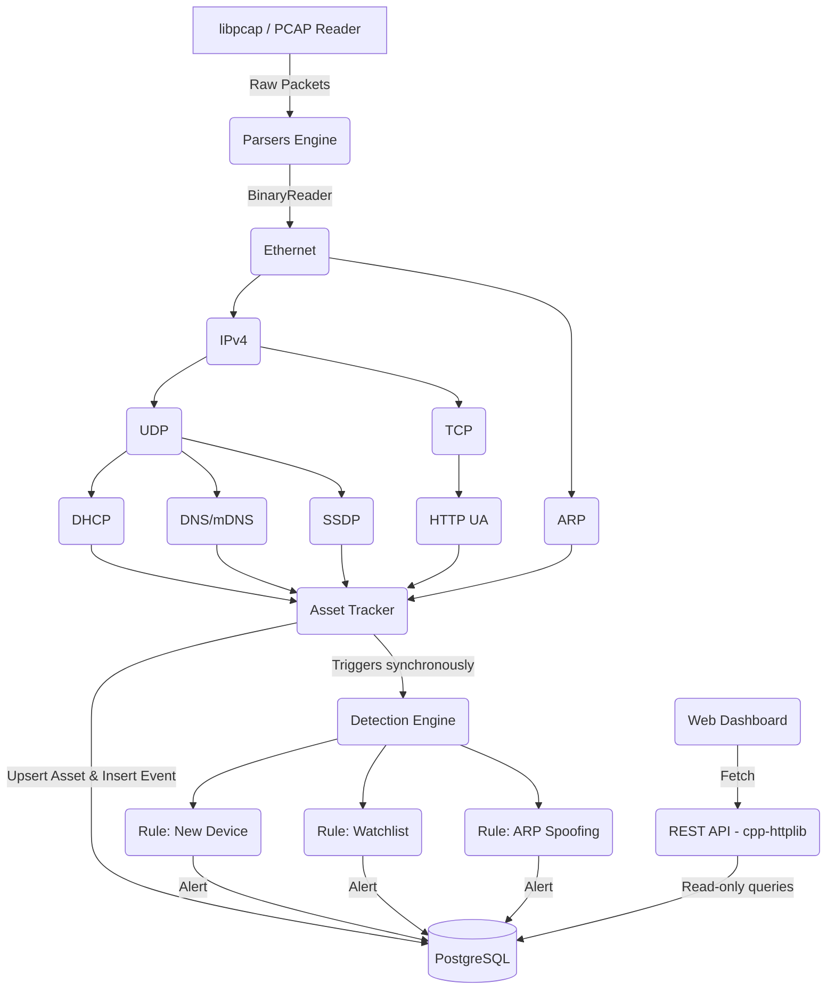

# PNADS (Passive Network Asset Discovery System) - Design Document

## Architecture Overview

PNADS is a passive network monitoring system that listens to network traffic (via PCAP file or live interface) without actively sending probes. It identifies connected assets, extracts metadata (OS, vendor, hostnames), detects anomalous behavior, and provides a web dashboard for visualization.

The system is built entirely in C++20 with a PostgreSQL backend and a React-like vanilla JS frontend.

### Component Diagram

## Key Design Principles

1.  **Single-threaded Capture, Lockless Tracker**: The `AssetTracker` is owned exclusively by the capture thread. There are no mutexes protecting the asset cache. The REST API and background tasks query PostgreSQL directly. This ensures the capture loop never blocks on a lock contention with a web request.
2.  **Robust Binary Parsing**: All protocol parsers utilize a unified `BinaryReader` class. This handles big-endian to little-endian conversions and bounds checking automatically, preventing buffer overflows and segmentation faults without requiring manual pointer arithmetic.
3.  **Rule-based Detection Engine**: Instead of complex machine learning models, PNADS uses a deterministic, rule-based detection engine. When an event is logged to the DB, the `DetectionEngine` is invoked synchronously to evaluate rules (e.g., ARP Spoofing, Watchlist Matches) and generate alerts.
4.  **Multi-Signal OS Fingerprinting**: The `OsFingerprint` module uses a weighted voting system based on signals from DHCP Option 55, HTTP User-Agent strings, SSDP SERVER headers, mDNS services, and IPv4 TTL values to confidently guess the operating system.

## Detection Rules

### 1. New Device Rule (`rule_new_device`)
-   **Trigger**: When `AssetTracker` emits a `new_asset` event.
-   **Logic**: Checks if the device is not marked as `trusted`. If not, generates a Medium severity alert. This happens exactly once per asset lifecycle.

### 2. Watchlist Rule (`rule_watchlist`)
-   **Trigger**: Any event.
-   **Logic**: Queries the `watchlist` table in the DB. If the asset's MAC or IP matches any entry in the watchlist, a High severity alert is generated with the user-defined label.

### 3. ARP Spoofing Rule (`rule_arp_spoofing`)
-   **Trigger**: ARP events (`arp_announce`, `ip_change`, `new_asset`).
-   **Logic**: Queries the DB to see if the current IP address is actively claimed by a different MAC address within the configured time window (default 60s). If multiple active MACs claim the same IP, a High severity alert is generated indicating potential ARP spoofing.
