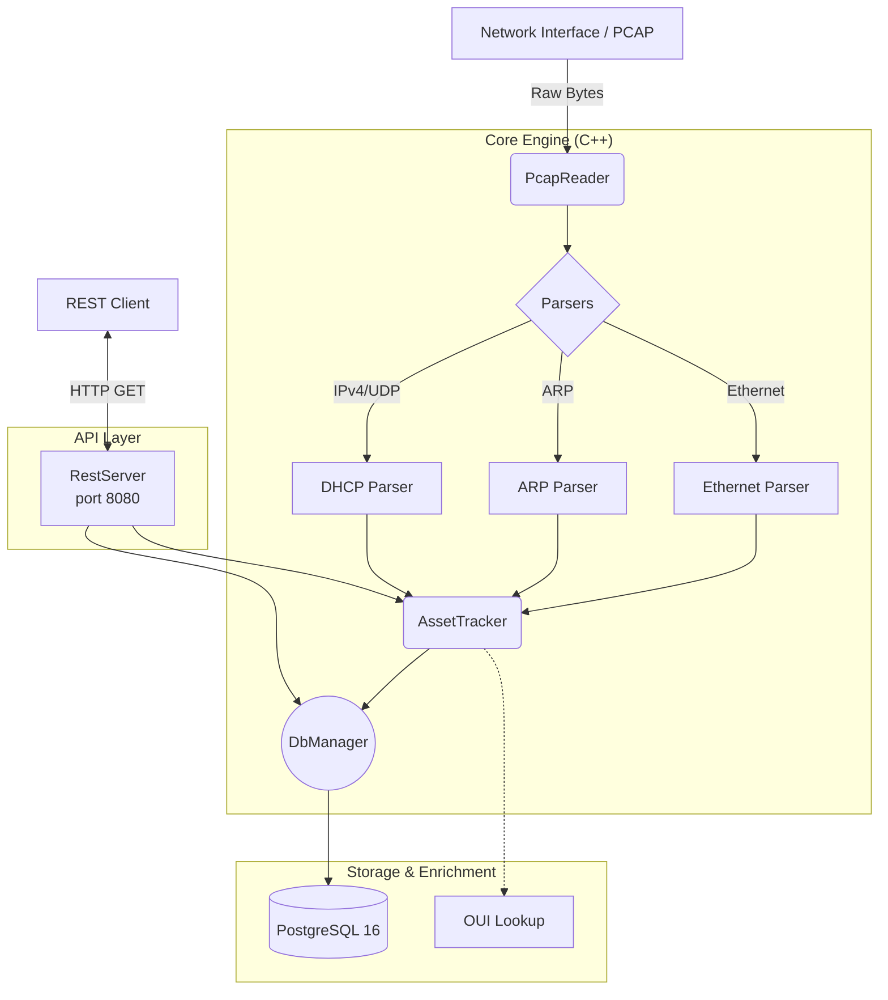

# Thiết kế Hệ thống

## Tổng quan
Hệ thống `passive-network-monitor` sử dụng kiến trúc kết hợp giữa **C++ Core Engine** và **REST API**, đóng gói trên môi trường **Docker**.

## Sơ đồ Kiến trúc

## Luồng Xử lý Đa luồng (Multi-threading)
Ở Phase 4, hệ thống chạy 2 luồng (threads) chính để đảm bảo khả năng đáp ứng:
1. **Luồng Capture (Main Thread):** Liên tục chạy `pcap_loop` để bắt gói tin từ card mạng hoặc file `.pcap`. Việc phân tích gói tin (parsing) và theo dõi tài sản (tracker) diễn ra đồng bộ trên luồng này nhằm tránh race conditions khi xử lý gói mạng.
2. **Luồng API Server (Background Thread):** Khởi tạo qua thư viện `cpp-httplib`, lắng nghe trên cổng 8080. Luồng này tiếp nhận yêu cầu từ client (ví dụ: `GET /api/assets`) và truy vấn trực tiếp vào PostgreSQL qua `DbManager`.

## Cơ sở dữ liệu (PostgreSQL)
- **Bảng `assets`**: Lưu trạng thái mới nhất của các thiết bị (MAC, IP, Hostname, OUI Vendor).
- **Bảng `events`**: Lưu lịch sử vòng đời của thiết bị (New Asset, DHCP Discover, IP Change).
- **View `asset_summary`**: Tổng hợp dữ liệu kết nối.

## API Endpoints
- `/health`: Trả về trạng thái hoạt động của Service và Database.
- `/api/assets`: Danh sách thiết bị dạng JSON array.
- `/api/stats`: Thống kê mạng tổng quan.

