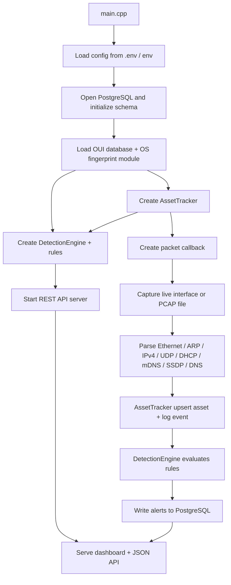

# PNADS Runtime Flow and Demo Guide

Tài liệu này tóm tắt luồng chạy thực tế của PNADS theo đúng code trong `src/`, đồng thời đề xuất các kịch bản demo dùng `scripts/` để bạn báo cáo nhanh và dễ trình bày.

## 1. PNADS chạy như thế nào

Luồng tổng quát của hệ thống:

### Điểm vào chính

- `src/main.cpp` là entry point.
- Ở đây hệ thống:
  - đọc cấu hình từ `.env` hoặc biến môi trường,
  - kết nối PostgreSQL,
  - khởi tạo `OuiLookup`, `OsFingerprint`, `AssetTracker`, `DetectionEngine`,
  - bật REST API,
  - rồi bắt đầu đọc packet từ live interface hoặc từ file PCAP.

### Hai chế độ chạy chính

1. Live capture
   - Khi `PCAP_FILE` rỗng, chương trình đọc từ `INTERFACE` bằng `pcap_open_live`.
   - Có BPF filter để chỉ giữ các gói liên quan: ARP, DHCP, mDNS, SSDP, DNS.

2. Offline / demo mode
   - Khi có `PCAP_FILE`, chương trình đọc file PCAP bằng `pcap_open_offline`.
   - Nếu không set `PCAP_FILE`, code còn có logic tìm file `.pcap` đầu tiên trong `samples/pcaplist/`.
   - Nếu có file upload qua API, file upload sẽ được ưu tiên xử lý trước, rồi mới quay lại stable PCAP loop.

## 2. Luồng xử lý từng gói tin

### 2.1 Capture layer

`src/capture/pcap_reader.cpp` mở nguồn đọc bằng libpcap, gắn filter và gọi callback cho từng frame.

### 2.2 Parse layer

Callback trong `main.cpp` đi theo thứ tự:

- Ethernet
- ARP hoặc IPv4
- nếu IPv4 thì tiếp tục UDP
- nếu UDP thì rẽ nhánh theo port:
  - DHCP: 67/68
  - mDNS: 5353
  - SSDP: 1900
  - DNS: 53

Mỗi parser đều bóc ra structured data để tracker dùng tiếp, không chỉ là text log.

### 2.3 Asset tracking

`src/tracker/asset_tracker.cpp` là nơi biến packet thành “tài sản mạng”:

- upsert asset theo MAC/IP,
- cập nhật hostname, vendor, OS guess,
- ghi event vào DB,
- gọi callback event để đẩy sang detection engine.

Các nguồn discovery được gắn vào `discovered_via`, ví dụ: `arp`, `dhcp`, `mdns`, `ssdp`.

### 2.4 Enrichment

Tracker có hai lớp làm giàu dữ liệu:

- `OuiLookup`: tra vendor theo OUI của MAC.
- `OsFingerprint`: ghép nhiều tín hiệu để đoán OS, gồm DHCP option 55, mDNS, SSDP, TTL, user-agent nếu có.

### 2.5 Detection

`src/detection/detection_engine.cpp` nhận event từ tracker và chạy các rule:

- `RuleNewDevice`:
  - bắn khi event là `new_asset`.
  - severity phụ thuộc vào việc đã biết vendor/OS hay chưa.

- `RuleWatchlist`:
  - so MAC/IP của asset với bảng `watchlist`.
  - nếu khớp, tạo alert `watchlist_match`.

- `RuleArpSpoofing`:
  - theo dõi cửa sổ thời gian cho các event ARP.
  - nếu một IP bị nhiều MAC khác nhau claim trong window, sinh alert `arp_spoofing`.

### 2.6 Persist và serve

`src/db/db_manager.cpp` lưu assets, events, alerts vào PostgreSQL.

`src/api/rest_server.cpp` mở HTTP server, serve dashboard tĩnh từ `web/`, và cung cấp API như:

- `/health`
- `/api/assets`
- `/api/events`
- `/api/alerts`
- `/api/watchlist`
- `/api/stats`
- `/api/stats/timeseries`
- `/api/pcap/upload`
- `/api/pcap/status`
- `/api/pcap/queue`

## 3. Demo có dùng file trong scripts được không

Có. Đây là cách demo tốt nhất vì scripts đã sinh sẵn dữ liệu đúng format mà parser của C++ đang đọc.

### File demo nên dùng

- `scripts/init_db.sql` để tạo schema.
- `scripts/seed_watchlist.sql` để seed dữ liệu cho rule watchlist.
- `scripts/generate_full_coverage_pcap.py` để tạo PCAP bao phủ nhiều parser và chứng minh pipeline hoạt động.
- `scripts/generate_violation_pcap.py` để tạo PCAP có vi phạm, kích hoạt alert rõ ràng.
- `scripts/download_oui.py` / `scripts/download_oui.sh` để có dữ liệu vendor MAC đầy đủ hơn.

### Vì sao scripts này phù hợp demo

- PCAP được build đúng thứ tự layer mà parser xử lý.
- `generate_full_coverage_pcap.py` tạo traffic “bình thường” để show asset discovery, enrichment, stats.
- `generate_violation_pcap.py` tạo tình huống có chủ ý để show alert.
- Upload PCAP qua API sẽ đẩy file vào queue và hệ thống xử lý ngay, rất hợp để demo live.

## 4. Kịch bản demo đề xuất

### Kịch bản A: Demo luồng chuẩn, không cảnh báo

Mục tiêu: cho thấy hệ thống phát hiện tài sản mạng, enrich vendor/OS, và hiển thị dashboard.

1. Khởi động PostgreSQL + PNADS.
2. Chạy `scripts/init_db.sql`.
3. Chạy `scripts/download_oui.py` để có OUI database.
4. Replay hoặc upload `samples/test.pcap` hoặc PCAP sinh từ `scripts/generate_full_coverage_pcap.py`.
5. Mở dashboard và chỉ ra:
   - danh sách assets,
   - events timeline,
   - thống kê timeseries,
   - vendor/OS guess.

Thông điệp khi thuyết trình:

- “Hệ thống hoạt động thụ động, không gửi probe.”
- “Mỗi thiết bị được nhận diện qua nhiều giao thức.”
- “Dữ liệu được lưu bền vững trong PostgreSQL và hiển thị qua REST API.”

### Kịch bản B: Demo alert an ninh

Mục tiêu: cho thấy detection engine thật sự sinh cảnh báo.

1. Chạy `scripts/init_db.sql`.
2. Chạy `scripts/seed_watchlist.sql`.
3. Sinh file bằng `python scripts/generate_violation_pcap.py`.
4. Upload `samples/violation.pcap` qua dashboard hoặc API `/api/pcap/upload`.
5. Chờ hệ thống xử lý và mở tab alerts.

Alert kỳ vọng:

- `new_device`: 3 alert cho 3 MAC mới.
- `arp_spoofing`: 1 alert cho IP bị nhiều MAC claim.
- `watchlist_match`: 1 alert cho MAC/IP đã seed.

Thông điệp khi thuyết trình:

- “Không chỉ quan sát, hệ thống còn phát hiện bất thường theo rule.”
- “Watchlist và ARP spoofing đều có thể tái hiện bằng PCAP thật.”

### Kịch bản C: Demo upload PCAP trực tiếp

Mục tiêu: cho thấy tính tương tác của hệ thống.

1. Mở dashboard.
2. Upload một file PCAP qua UI.
3. Theo dõi `/api/pcap/status` và `/api/pcap/queue`.
4. Chỉ ra trạng thái `idle`, `stable_loop`, hoặc `priority` tùy chế độ xử lý.

Điểm mạnh của kịch bản này:

- không cần live network thật,
- rất ít rủi ro trình diễn,
- dễ lặp lại trước giờ báo cáo.

## 5. Gợi ý thứ tự trình bày khi báo cáo

1. Nói ngắn gọn bài toán: passive asset discovery, không gây ảnh hưởng mạng.
2. Vẽ luồng: PCAP/live capture → parser → tracker → detection → DB → REST API/dashboard.
3. Demo `generate_full_coverage_pcap.py` để show discovery/enrichment.
4. Demo `generate_violation_pcap.py` để show alert.
5. Kết bằng dashboard, alert list, and stats.

## 6. Ghi chú thực tế khi demo

- Nếu muốn demo ổn định nhất, nên dùng file PCAP thay vì live capture.
- Nếu muốn show alert watchlist, phải seed trước bằng `scripts/seed_watchlist.sql`.
- Nếu chưa có dữ liệu OUI, hệ thống vẫn chạy được nhưng vendor có thể kém chi tiết hơn.
- `scripts/generate_violation_pcap.py` là file mạnh nhất cho phần “wow effect” vì nó trigger đúng 3 rule chính.
